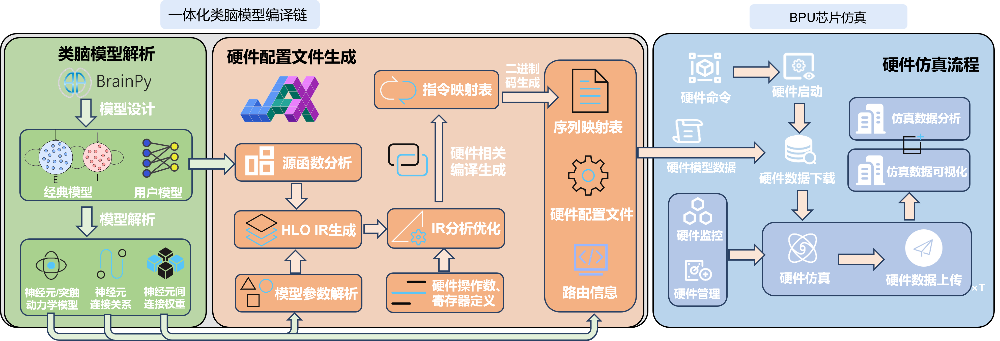

如何安装
========

从 `Git Hub <https://github.com/uger06/bpu>`_ 将源文件下载到本地,
然后参照教程使用BPU-SDK。

软件栈
-------
软件栈构成目录

.. code-block:: yaml

    BrainpyAdapter:
    Common:
    HardwareConfig:
    Mapping:
    SNNCompiler:
        snn_compiler_32bit: "32bit smt"
        snn_compiler_64bit: "64bit smt"
        snn_compiler_96bit: "96bit smt"
    SNN28nm.py
    SNN40nm.py

软件栈框架
----------

调用方法
---------

.. code-block:: python

   python SNN28nm.py
   python SNN40nm.py
